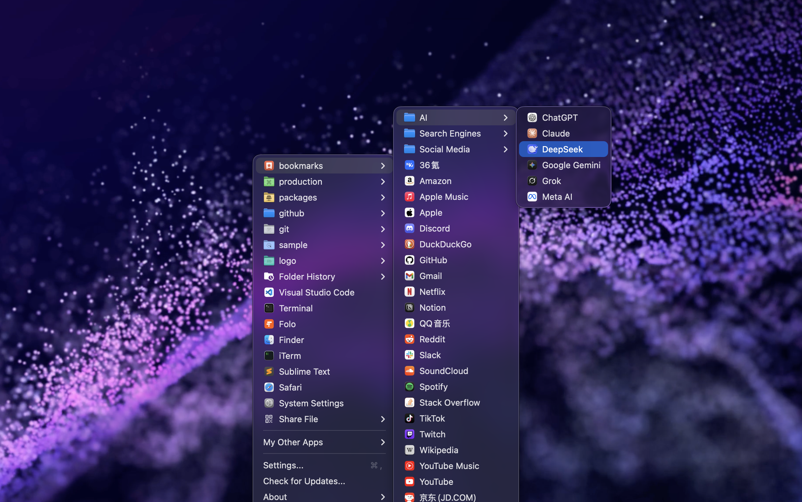
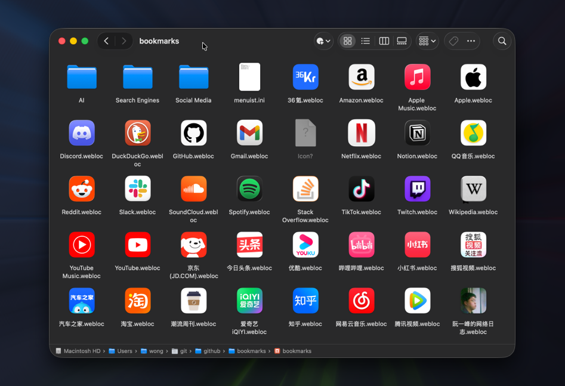
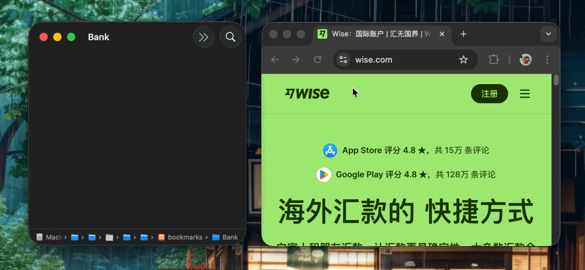

<p>
<a href="./README.zh.md">中文</a>
</p>

<div markdown="1">
  <sup>Using <a href="https://wangchujiang.com/#/app" target="_blank">my app</a> is also a way to <a href="https://wangchujiang.com/#/sponsor" target="_blank">support</a> me:</sup>
  <br>
  <a target="_blank" href="https://jaywcjlove.github.io/maslink/?id=6766860898" title="Zipora: Zip/RAR/7Z Unarchiver"></a>
  <a target="_blank" href="https://jaywcjlove.github.io/maslink/?id=6758053530" title="Scap: Screenshot & Markup Edit for macOS"></a>
  <a target="_blank" href="https://jaywcjlove.github.io/maslink/?id=6757317079" title="Screen Test for macOS"></a>
  <a target="_blank" href="https://jaywcjlove.github.io/maslink/?id=6755948110" title="Deskmark for macOS"></a>
  <a target="_blank" href="https://jaywcjlove.github.io/maslink/?id=6500434773" title="Keyzer for macOS"></a>
  <a target="_blank" href="https://github.com/jaywcjlove/vidwall-hub" title="Vidwall Hub for macOS"></a>
  <a target="_blank" href="https://jaywcjlove.github.io/maslink/?id=6752624705" title="VidCrop for macOS"></a>
  <a target="_blank" href="https://jaywcjlove.github.io/maslink/?id=6747587746" title="Vidwall for macOS"></a>
  <a target="_blank" href="https://wangchujiang.com/mousio-hint/" title="Mousio Hint for macOS"></a>
  <a target="_blank" href="https://jaywcjlove.github.io/maslink/?id=6746747327" title="Mousio for macOS"></a>
  <a target="_blank" href="https://jaywcjlove.github.io/maslink/?id=6745227444" title="Musicer for macOS"></a>
  <a target="_blank" href="https://jaywcjlove.github.io/maslink/?id=6743841447" title="Audioer for macOS"></a>
  <a target="_blank" href="https://jaywcjlove.github.io/maslink/?id=6744690194" title="FileSentinel for macOS"></a>
  <a target="_blank" href="https://jaywcjlove.github.io/maslink/?id=6743495172" title="FocusCursor for macOS"></a>
  <a target="_blank" href="https://jaywcjlove.github.io/maslink/?id=6742680573" title="Videoer for macOS"></a>
  <a target="_blank" href="https://jaywcjlove.github.io/maslink/?id=6740425504" title="KeyClicker for macOS"></a>
  <a target="_blank" href="https://jaywcjlove.github.io/maslink/?id=6739052447" title="DayBar for macOS"></a>
  <a target="_blank" href="https://jaywcjlove.github.io/maslink/?id=6739444407" title="Iconed for macOS"></a>
  <a target="_blank" href="https://jaywcjlove.github.io/maslink/?id=6737160756" title="Menuist for macOS"></a>
  <a target="_blank" href="https://jaywcjlove.github.io/maslink/?id=6723903021" title="Paste Quick for macOS"></a>
  <a target="_blank" href="https://jaywcjlove.github.io/maslink/?id=6670696072&platform=mac" title="Quick RSS for macOS/iOS"></a>
  <a target="_blank" href="https://jaywcjlove.github.io/maslink/?id=6670167443" title="Web Serve for macOS"></a>
  <a target="_blank" href="https://jaywcjlove.github.io/maslink/?id=6503953628&platform=mac" title="Copybook Generator for macOS/iOS"></a>
  <a target="_blank" href="https://jaywcjlove.github.io/maslink/?id=6471227008&platform=mac" title="DevTutor for macOS/iOS"></a>
  <a target="_blank" href="https://jaywcjlove.github.io/maslink/?id=6479819388&platform=mac" title="RegexMate for macOS/iOS"></a>
  <a target="_blank" href="https://jaywcjlove.github.io/maslink/?id=6479194014&platform=mac" title="Time Passage for macOS/iOS"></a>
  <a target="_blank" href="https://jaywcjlove.github.io/maslink/?id=6478772538" title="IconizeFolder for macOS"></a>
  <a target="_blank" href="https://jaywcjlove.github.io/maslink/?id=6478511402&platform=mac" title="Textsound Saver for macOS/iOS"></a>
  <a target="_blank" href="https://jaywcjlove.github.io/maslink/?id=6476924627" title="Create Custom Symbols for macOS"></a>
  <a target="_blank" href="https://jaywcjlove.github.io/maslink/?id=6476452351" title="DevHub for macOS"></a>
  <a target="_blank" href="https://jaywcjlove.github.io/maslink/?id=6476400184" title="Resume Revise for macOS"></a>
  <a target="_blank" href="https://jaywcjlove.github.io/maslink/?id=6472593276" title="Palette Genius for macOS"></a>
  <a target="_blank" href="https://jaywcjlove.github.io/maslink/?id=6470879005" title="Symbol Scribe for macOS"></a>
</div>
<hr>

Menuist Bookmarks
===

[](https://jaywcjlove.github.io/#/sponsor)
[](https://x.com/jaywcjlove)

This project provides bookmark data for [Menuist](https://github.com/jaywcjlove/rightmenu-master) v4.1+. Simply add the [`bookmarks`](./bookmarks/) folder from this project to Menuist's common directories to quickly generate a website navigation menu for convenient access to frequently used websites.



The bookmarks in this project are stored using macOS and iOS system's `.webloc` file format, where each `.webloc` file is a shortcut pointing to a specific URL. By organizing websites into folders and combining them with Menuist's common directory navigation feature, you can quickly access organized website lists, creating a website navigation-like experience.



## Directory Structure

```shell
├── bookmarks/          # Store .webloc files (supports subfolders)
│   ├── menuist.ini     # ⚠️ Menuist configuration
│   ├── GitHub.webloc
│   ├── Gmail.webloc
│   ├── AI/             # Supports subfolders
│   │   ├── ChatGPT.webloc
│   │   ├── Claude.webloc
│   │   └── ...
│   └── ...
├── icons/              # Store icon files
│   ├── github.com.icns
│   ├── google.com.icns
│   ├── chatgpt.com.icns
│   └── ...
├── set_icons.swift     # Swift source code
└── set_icons           # Compiled binary file
```

## Add a new bookmark

1️⃣ In the [`bookmarks/`](./bookmarks/) directory, create a text file named [`Apple.webloc`](./bookmarks/Apple.webloc) (with the `.webloc` extension). Paste the following `XML` content into it, and edit the URL as needed.

```xml
<?xml version="1.0" encoding="UTF-8"?>
<plist version="1.0">
  <dict>
    <key>URL</key>
	  <string>https://www.apple.com/</string>
  </dict>
</plist>
```



2️⃣ Add a Bookmark Icon

Place the downloaded `.icns` icon file into the `icons` directory and name it after the website, for example [`apple.com.icns`](./icons/apple.com.icns).

Then run the [`./set_icons`](./set_icons) command to automatically apply the icon to the [`Apple.webloc`](./bookmarks/Apple.webloc) file.

You can obtain or create `.icns` icon files in the following ways:

- Download ready-made icons from [macOSicons](https://macosicons.com)
- Create custom app icons using [Iconed](https://apps.apple.com/app/iconed/id6739444407)
- Create folder icons and export them as `.icns` using [Iconize Folder](https://apps.apple.com/app/iconize-folder/id6478772538)

## Setting Icons for webloc Files

The script can automatically set icons for `.webloc` files by matching corresponding icon files from the `icons` directory based on the domain name of the URL.

1️⃣ Method 1: Run Swift script directly (requires Swift installation)

```bash
swift set_icons.swift
```

2️⃣ Method 2: Compile to binary file (recommended)

If you don't have a Swift environment to run the Swift script, you can directly run the [`./set_icons`](./set_icons) command file to set file icons.

```bash
# Manual compilation to generate a binary file
swiftc -o set_icons set_icons.swift

# Make the command executable
chmod +x set_icons

# Run
./set_icons
```

Available command options:

```bash
# Set icons for .webloc files. This is the default behavior.
./set_icons --set-icons

# Generate a static bookmark navigation page at .html/index.html.
# Web icons are exported to .html/icons/.
./set_icons --generate-html

# Generate .html and commit it to the gh-pages branch.
# The command also writes .nojekyll on gh-pages for GitHub Pages.
./set_icons --publish-gh-pages
```

If you see `zsh: bad CPU type in executable: ./set_icons` on an Intel Mac, the existing binary was built for a different CPU architecture. Rebuild an Intel binary:

```bash
swiftc -target x86_64-apple-macosx13.0 -o set_icons set_icons.swift
chmod +x set_icons
```

To generate a universal binary that supports both Apple Silicon and Intel Macs, compile the two architecture-specific binaries first, then merge them with `lipo`:

```bash
swiftc -target arm64-apple-macosx13.0 -o set_icons_arm64 set_icons.swift && \
swiftc -target x86_64-apple-macosx13.0 -o set_icons_x86_64 set_icons.swift && \
lipo -create -output set_icons set_icons_arm64 set_icons_x86_64 && \
chmod +x set_icons
```

The `lipo` command cannot compile source code by itself. If `set_icons_arm64` or `set_icons_x86_64` does not exist yet, run the full command block above instead of running only the `lipo` line.

## Configuration

Place a [`menuist.ini`](./bookmarks/menuist.ini) configuration file in the root of your bookmarks directory to hide certain menu items and keep the bookmarks menu tidy.  Alternatively, you can use a hidden file `.menuist.ini` as the configuration.

```ini
[options]
; Show file extensions
showFileExtension = false
; Show frequently used apps menu
showCommonAppMenu = false
; Show "Open in Finder" menu
showOpenInFinderMenu = false
; Show parent folder menu
showParentFolderMenu = false
```

## License

MIT © [Kenny Wong](https://wangchujiang.com)
